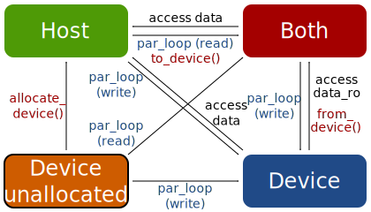

class: center, middle, inverse

# Backup Slides

---

.scale[]

---

## PyOP2 Partitioning, Staging & Coloring

### Key optimizations performed by PyOP2 runtime core

* *Partitioning* for on-chip memory (shared memory / cache)
* *Coloring* to avoid data races on updates to the same memory location

### Example

Parallel computation executing a kernel over the edges of the mesh:
```python
# Sets of nodes and edges
nodes = op2.Set(N) # N = number of nodes
edges = op2.Set(M) # M = number of edges

# Mapping from edges to nodes
edge_to_node_map = op2.Map(edges, nodes, 2, ...)

# Data defined on nodes
u = op2.Dat(nodes, ...)

# Kernel executing over set of edges, computing on nodal data
op2.par_loop(kernel, edges,
             u(op2.INC, egde_to_node_map))
```

---

background-image:url(images/partitioning.svg)

---

background-image:url(images/staging.svg)

---

background-image:url(images/coloring.svg)
